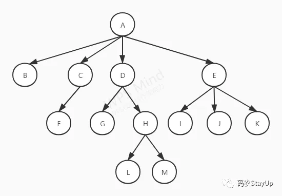

# Tree

树是一种非线性的数据结构，它包含n(n>=1)个节点，(n-1)条边的有穷集合。把它叫做“树”是因为它看起来像一个倒挂的树，也就是说它是根朝上，叶子朝下的。



## 常用术语

```text
节点（node）: 树结构中的每一个元素称为一个节点，如上图中的ABC......M
根节点（root）: 没有父节点的节点叫做根节点，如上图中的A
父节点（parent）: 一个节点的上级节点叫做它的父节点，一个节点最多只能有一个父节点，如上图中C是F的父节点
子节点（child）: 一个节点的下级节点叫做它的子节点，一个节点的子节点可以有多个，如上图中的IJK是E的子节点
兄弟节点（siblings）: 拥有相同父节点的节点叫做兄弟节点，如上图中的L和M是兄弟节点
叶子节点（leaf）: 没有子节点的节点叫做叶子节点，如图中的BFGLMIJK
边（dege）: 父子节点间的连接称为边，一棵树的边数为(n-1)
节点的权（weight）: 节点上的元素值
路径（path）: 从root节点找到该节点的路线，如上图中L的路径为A-D-H-L。路径的长为该路径上边的条数，L路径的长为3（n-1）
层（layer）: 距离根节点相等的路径长度为一层，如上图中A为第一层；BCDE为第二层；FGHIJK为第三层；LM为第四层
子树（child tree）: 以某一节点（非root）做为根的树称为子树，如以E为根的树称为A的子树
树的高度（height）: 树的最大层数，上图中树的高度为4
森林（words）: 多棵子树构成树林
```

## B-Tree

```text
定义：B 树（B-tree）是一种自平衡的搜索树，能够保持数据有序。
特征：
1. 每个节点最多只有m个子节点。
2. 每个非叶子节点（除了根）具有至少⌈ m/2⌉子节点，含有ceil(m/2)-1到m-1个元素。
3. 如果根不是叶节点，则根至少有两个子节点。
4. 具有k个子节点的非叶节点包含k -1个键。
5. 所有叶子都出现在同一水平。

根节点：在m阶B树中（根节点非树中唯一节点），那么根结点有关系式2<= M <=m，M为子节点数量；包含的元素数量 1<= K <=m-1,K为元素数量。
内部节点：在m阶B树的内部节点的子节点数量为M，则一定要符合（m/2）<=  M <=m关系式，包含元素数量M-1；包含的元素数量 （m/2）-1<= K <=m-1,K为元素数量。m/2向上取整。
叶子节点：在m阶B树中叶子节点的元素符合（m/2）-1<= K <=m-1

```

## Refs
[alg](https://www.notion.so/AlgorithmsX-996eee25cae147739badfaf75963b1cb)
