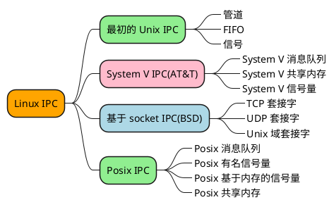

## Linux IPC
***


***
## IPC 对象的持续性
***
```text
IPC 的持续性（persistence）该 IPC 类型的一个对象一直存在多长时间
```
### 三种类型的持续性
***
#### 随进程持续（process-persistent）

随进程持续的（process-persistent） IPC 对象一直存在到打开着该对象的最后一个进程关闭该对象 为止。
例如管道和 FIFO 就是这种对象。

#### 随内核持续（kernel-persistent）

随内核持续的（kernel-persistent） IPC 对象一直存在到内核重新自举或显式删除该对象为止。例
如 System V 的消息队列、信号量和共享内存区就是此类对象。 Posix 的消息队列、信号量和共享内存区
必须至少是随内核持续的，但也可以是随文件系统持续的，具体取决于实现。

#### 随文件系统持续（filesystem-persistent）
随文件系统持续的 （filesystem-persistent）IPC 对象一直存在到显式删除 该对象为止。
即使内核重新自举了，该对象还是保持其值。 
Posix 消息队列、信号量和共享内存区如果是使用映 射文件实现的（不是必需条件），那么它们就是随文件 系统持续的。
***
## 各 IPC 类型的持续性
***

| IPC 类型  | 持续性|
| :--- | :----: |
| 管道 | 随进程 |
| FIFO | 随进程 |
| 信号 | 随进程 |
| Posix 互斥锁 | 随进程 |
| Posix 条件变量 | 随进程 |
| Posix 读写锁 | 随进程 |
| fcntl 记录上锁 | 随进程 |
| Posix 消息队列 | 随内核 |
| Posix 有名信号量 | 随内核 |
| Posix 基于内存的信号量 | 随内核 |
| Posix 共享内存 | 随内核 |
| System V 消息队列 | 随内核 |
| System V 共享内存 | 随内核 |
| System V 信号量 | 随内核 |


