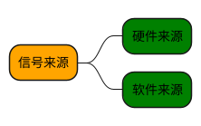
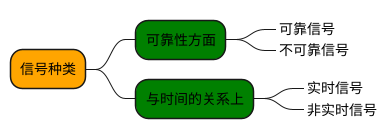
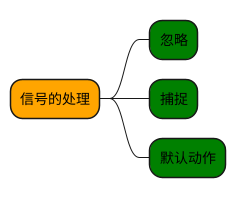

# 信号
***
## 信号来源



Ps:
1. 硬件来源：比如我们按下了键盘或者其它硬件故障
2. 软件来源，最常用发送信号的系统函数是 kill, raise, alarm 和 setitimer 以及 sigqueue 函数，软件来源还
  包括一些非法运算等操作
***
## 信号的种类


Ps：
1. 信号的可靠与不可靠只与信号值有关，与信号的发送及安装函
  数无关
2. 非实时信号都不支持排队，都是不可靠信号；实时信号都支持排队，都是可靠信号
***

## 进程对信号的响应


Ps:
1. 两种信号不能被忽略（分别是 SIGKILL和SIGSTOP）因为他们向内核和超级用户提供了进程终止和停止的可靠方法，如果忽略了，那么这个进程就变成了没人能管理的的进程
2. 进程对实时信号的缺省反应是进程终止
***

## 信号的发送
发送信号的主要函数有： 
- kill()
- raise()
- sigqueue()
- alarm()
- setitimer()
- abort()

**kill**
```c
#include <sys/types.h>
#include <signal.h>
int kill(pid_t pid,int signo)
// the null signal (0) can be used to check if a process with a given PID exists.
```

**raise**
```c
#include <signal.h>
int raise(int signo)
```

**sigqueue**
```c
#include <sys/types.h>
#include <signal.h>
int sigqueue(pid_t pid, int sig, const union sigval val)
```

```c
union sigval {
    int sival_int;
    void *sival_ptr;
};
```

Ps:
1. sigqueue 发送非实时信号时，仍然不支持排队，即在信号处理函数执行过程中到来的所有相同信号，都被合并为一个信号

**alarm**
```c
#include <unistd.h>
unsigned int alarm(unsigned int seconds)
```

**setitimer**
```c
#include <sys/time.h>
int setitimer(int which, const struct itimerval *value, struct itimerval*ovalue));
```

**abort**
```c
#include <stdlib.h>
void abort(void);
```

***
## 信号的安装

信号的安装函数：
- signal()
- sigaction()

Ps:
1. signal 是库函数而 sigaction 是系统调用

**signal**
```c
#include <signal.h>
typedef void (*sighandler_t)(int);
sighandler_t signal(int signum, sighandler_t handler);
```
```c
#include <stdio.h>
#include <signal.h>
void handle(int s)
{
	printf("Hello!start\n");
	sleep(10);
	printf("Hello!end\n");
}

int main(int argc, char **argv)
{
	signal(SIGINT,handle);
	while(1);
}
```

**sigaction**
```c
#include <signal.h>
int sigaction(int signum,const struct sigaction *act,struct sigaction*oldact));
```
```c
#include <stdio.h>
#include <signal.h>

#include <unistd.h>
/*
void handle(int s)
{
	printf("OOOK!\n");
	sleep(5);
	printf("K000!\n");
}*/
void handle(int s,siginfo_t* info,void *d)
{
	printf("OOOK:%d\n",info->si_int);
	sleep(5);
	printf("K000!\n");
}

int main(int argc, char **argv)
{
	struct sigaction act={0};
		
	//act.sa_handler=handle;
	act.sa_sigaction=handle;
	sigemptyset(&act.sa_mask);
	sigaddset(&act.sa_mask,SIGINT);
	
	act.sa_flags=SA_SIGINFO;
	
	sigaction(SIGUSR1,&act,0);
	
	while(1);
}
```
***
## 信号集及信号集操作函数

```c
typedef struct {
    unsigned long sig[_NSIG_WORDS];
} sigset_t
```

相关函数:
```c
#include <signal.h>

int sigemptyset(sigset_t *set); // 初始化 set 中传入的信号集，清空其中所有信号
int sigfillset(sigset_t *set); // 把信号集填1，让 set 包含所有的信号
int sigaddset(sigset_t *set, int signum); // 把信号集对应位置为1
int sigdelset(sigset_t *set, int signum); // 把信号集对应位置为0
int sigismember(const sigset_t *set, int signum); // 判断signal是否在信号集
```
***
## 信号阻塞与信号未决

与信号阻塞相关的几个函数：
```c
#include <signal.h>
int sigprocmask(int how, const sigset_t *set, sigset_t *oldset));
int sigpending(sigset_t *set));
int sigsuspend(const sigset_t *mask));
```
